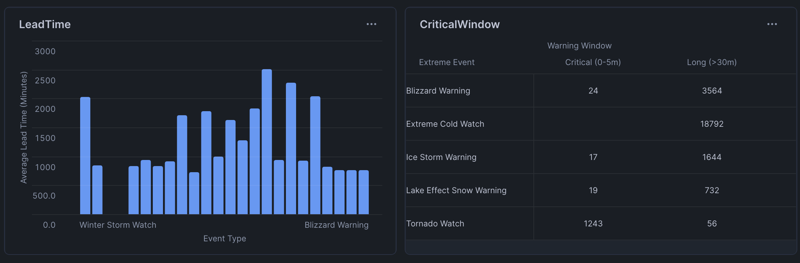
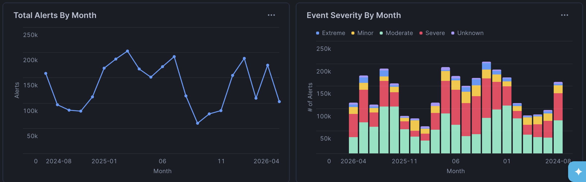
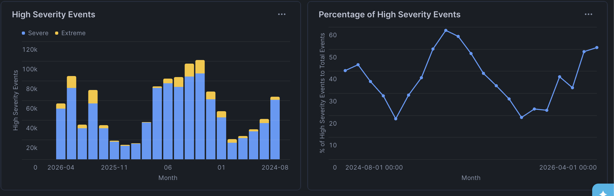

# MIST4610-Group-Project-2
Group 2

## Members:
1. Sean Donovan - [@sean4565](https://github.com/sean4565)
2. Aaron Eason - [@aceeason](https://github.com/aceeason)
3. Gilbert Fahnbulleh - [@gsf11597](https://github.com/gsf11597)
4. Navi Khan - [@NaviKhan15](https://github.com/NaviKhan15)
5. Kiera Lumley - [@ksl05149](https://github.com/ksl05149)
8. Steven Thomas - [@st11521](https://github.com/st11521)

## Dataset Description:
Our group selected the NWS_WEATHER_ALERT_EVENTS because we wanted to analyze weather alert patterns, and gain a better understanding of weather alerts, reaction, and types that happened across the country. Our dataset has 18 columns and 2.8 million rows. 
The provider of this data is the National Weather Service and is found through SNOWFLAKE_PUBLIC_DATA_FREE.PUBLIC_DATA_FREE.NWS_WEATHER_ALERT_EVENTS. 

Key Columns:
- EVENT_TYPE (VARCHAR)
- EVENT_SEVERITY (VARCHAR)
- SENTTIMPSTAMP (TIMESTAMP_NTZ)
- COUNTY_GEO_ID (VARCHAR)

## Questions and Justification:
Question 1: What is the average lead time (time from when the alert is sent and when the event actually begins) to prepare for Extreme vs. Severe events, and which specific event type provides the shortest window for public response? The relevant columns are EVENT_TYPE, EVENT_SEVERITY, SENT_TIMESTAMP, and ONSET_TIMESTAMP. This question requires calculating interval gaps between two times. It also requires aggregation and filtering to exclude post-onset alerts (where the event has already started) to ensure the average isn't skewed by ongoing or past warnings. This reveals the technical limitations of the forecasting. If extreme tornado warnings have a significantly shorter lead time than severe ones, it highlights a critical vulnerability in emergency preparedness where the most dangerous events are the hardest to predict in advance.

Question 2: How do the frequency and severity compare across the different months in the dataset?
The relevant columns are EVENT_TYPE, SENT_TIMESTAMP, ONSET_TIMESTAMP, and EVENT_SEVERITY. This questions requires calculating which type of event occurs during what time in the year it is. It requires aggregation and filtering to coordinate month, and weather occurence type.

## Data Manipulation:
 Query 1: To prepare the dataset for analysis, we first had to ensure that the lead time calculations would be accurate and meaningful.  We had to exclude the any rows where the OFF_SETSTAMP was had been earlier or equal to the SENT_TIMESTAMP removing any events that had started before or at the same time the alert had been sent as those results would have came to late and not send any real warning to people. We have also narrowed the data set to only contain events that are characterizes as severe or extreme to focus on the most impactful weather events to ensure that the results would be more impactful in ensuring emergency preparedness and public safety. We computed the difference in time from when an event begins and when the alert is sent using DATEDIFF creating a new metric of lead time to answer how much preperation time is avaliable. The query then aggregates the results by EVENT_TYPE and EVENT_SEVERITY to allow for meaning ful comparisons across different weather events and severity. Then the results are sorted in ascending order of average lead time,making it easier to to identify whick events have the shortest warning window and so posing the greatest risk.

 Query 2: This query analyzes how the frequency and severity of weather alerts change throughout the year by organizing the time data. It extracts the month from SENT_TIMESTAMP using DATE_TRUNC('MONTH', SENT_TIMESTAMP) to create a standardized monthly timestamp and MONTH(SENT_TIMESTAMP) to generate a numeric month value for calendar ordering. The data is filtered to contain only "Extreme" and "Severe" alerts, then groups the data by EVENT_SEVERITY, month and month number, using COUNT(*) to calcuate how many alerts occur in each category. Then they are sorted by chonological order and alert count to highlight periods of most activity. 

 Query 3:This query transforms the dataset to highlight how the proportionof high severity weather alerts changes throught the year

Query 2:
 
## Analysis and Results:
Question 1:

Query 1: The chart shows the average number of minutes between an alert and when the event actually starts. It reveals that high velocity events such as tornadoes have significantly smaller preparation times compared to slower events like winter storms. It also highlights where it is more difficult to forecast events, as those with shorter intervals have much slimmer margins for error. It allows stakeholders to see which weather events they need to focus on trying to increase alert time on. If alert time can not be changed, they need to increase the education around these events so that the public can correctly respond when they receive an alert. 

Query 2: This heatgrid categorizes extreme events into specific lead-time buckets to visualize the actual window of opportunity the public has to seek safety. By identifying what percentage of the most dangerous events provide less than five minutes of warning, you can pinpoint specific event types where current forecasting technology fails to provide a safe margin of error. The data further proves that tornado watches are the most common critical events, and extreme cold watches give people much more time to prepare.

Question 2:

Query 1: The number of monthly alert chart gives us information about weather-related activities that occur throughout the year. This allows stakeholder to learn which months of the year they need to be more prepared for weather events. This information can also be used for the future to see if weather alerts are increasing over time. This allows stakeholders to have better scheduling and resource distributions. The stakeholders will know what are the worse months and prepare for them accordingly. 

Query 2: This bar chart shows us the amount of alerts that have occurred each month during the time period while also allowing us to see the severity of each type of alert during that month. From this data, we can see that the most types of alerts are either moderate or severe. This data gives information to the public about which months they should they most be prepared for severe weather. They can create the correct types of weather emergency plans and have go bags prepared in those severe weather months. Allows people to be more proactive than reactive to severe weather events. 

Query 3: This chart focuses on the just the severe weather alerts, specifically alerts of severe and extreme. These events will have the highest risk towards public safety so there needs to be information out there on how to be prepared for these events. The data shows us that the more severe weather months are during spring and summer while the less severe weather months are during the winter. This relates to the other graph because it shows that resources and staffing should be more prepared and available during the summer months where there are more severe weather events. 

Query 4: While our previous query shows us the number of alerts severe weather events have during each month, this query allows us to see how many of the total events are severe weather events. We are able to see which months have the highest risk intensity. It is helpful for our stakeholders as to see that some months may have a lot of alerts but the majority of them are actually minor. They can have a higher level of readiness for these high risk months. 

## Streamlit App
